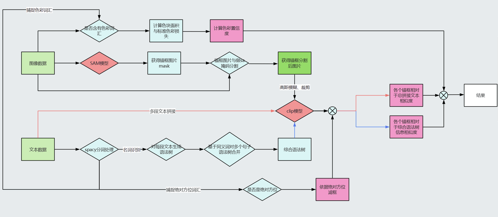

# README

[toc]


## 一、代码运行命令

### 1.环境配置：

```
pip install -r requirements.txt
```

### 2.运行命令：

```split: select from val, testa and testb``` \
```save_dir: path to save your results```

```python
CUDA_VISIBLE_DEVICES=0 python main.py \
      --input_file 'data/{split}.jsonl' \
      --detector_file 'data/dets_dict.json' \
      --image_root 'data/train2014' \
      --cache_path '{save_dir}/cache' \
      --results_path 'code/result/{split}.json'\
      --sam_pt_path 'code/sam_pt'\
      --sam_checkpoint 'sam模型权重路径'\
```

>运行命令说明：
>
>```python
>--input_file  data/{split}.jsonl    数据文件
>--detector_file 'data/dets_dict.json'  检测框文件
>--image_root 'data/train2014'   图片路径
>--cache_path '{save_dir}/cache' 缓存路径
>--results_path 'code/result/{split}.json'  结果保存路径
>--sam_pt_path 'code/sam_pt' sam生成的缓存保存路径
>--sam_checkpoint 'sam模型权重路径(一定要设置)'
>```
>
>例如：
>
>```python
>python main.py --input_file 'data/val/annos.jsonl' --detector_file 'data/dets_dict.json' --image_root 'data/val/images' --cache_path 'code/result/cache' --results_path 'code/result/result.json' --sam_pt_path 'code/sam_pt' --sam_checkpoint 'E:\全球校园人工智能算法精英大赛\算法挑战赛文件\SAM\SAM模型权重\sam_vit_h_4b8939.pth'
>```
>
>

## 二、算法流程图

### 1. 算法流程总览



### 2. 算法流程说明

#### 2.1 模型选择

1. clip使用ViT-B32与RN50X6权重参数
2. SAM使用samhuge权重参数

#### 2.2 模型模块

##### 2.2.1 综合信息模块

该模块将题目中出现的多段文本描述做拼接处理，合成一段具有综合语义信息的长语句，将其与所有锚框中的图片生成相似度，生成综合语义内容信息相似度。

##### 2.1.2 reclip语法信息模块

传统reclip基于语法信息生成语法树，通过节点（名词）之间的语法联系，以此完成对方位的解析任务。这种方法能够有效提升单个语句对于方位的辨识任务。但是在本次任务中，面对多个包含不同语义信息的语句指向同一目标的任务，如果沿用reclip而采用一个句子对一个目标的方式会导致语义信息的缺失，无法综合衡量目标与周围环境的详细信息。因此我们提出将多个指向同一目标的语句通过同义词检测的方式，将相似的节点合并，使得相似节点能够获取其它节点的后缀信息，以此完成语法树的合并。在检测到同义词出现在多个语法树上时，我们会减低所在树的最终权重，以此避免重复词语带来的语法树冗余信息的主导。

##### 2.1.3  颜色信息模块

通过对于数据集结果分析，发现传统clip模型对于颜色信息识别许多情况并不准确，我们提出颜色信息模块，以此修正颜色的偏差。我们会将图片转换到hsv空间，通过色调、饱和度、明度信息筛选出与对应颜色文本匹配的色彩区域mask，之后对色彩mask内部区域与标准rgb色值求出偏差，最后对每一个框求出色彩区域比重和颜色偏差均值，将上面信息转换为概率值相乘，得出综合色彩面积与色彩信息的色彩置信概率

##### 2.1.4 绝对方位模块

reclip在面对许多包含绝对方位计算缺陷较为明显，这是由于reclip在绝对方位计算往往是针对单个名词，没有考虑全局信息，这导致该信息会被兄弟节点通过加和的方式削弱，到达根节点时无法正确反映物体绝对位置信息。为此，我们检测句子中关键的方位词语，通过判断方位词前后是否含有名词来判断该方位词是否是绝对方位，一旦确定方位情况，会将反方向锚框全部过滤。


#### 2.3 综合说明

在得到四个模块的概率信息后，我们会将这四部分信息相乘得到最终的结果，最终选择概率最高的值对应的锚框作为这些句子的同一目标答案。

## 三、参数的选择和定义

> 此处只有官方给出参数的一些值的设定

| 参数               | 值    |
| ------------------ | ----- |
| box_area_threshold | 0.045 |
| enlarge_boxes      | 0.2   |
| blur_std_dev       | 100   |
| baseline_threshold | 2     |
| temperature        | 5     |


